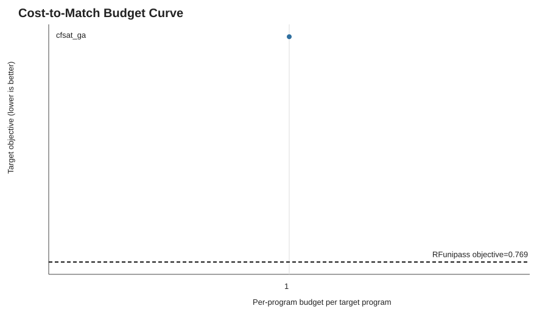

# RFunipass vs Per-Program Cost-Parity Summary

- Match rule: `perprogram_objective <= rfunipass_objective + 0.005`
- Safety rule: `perprogram_worsen_rate <= rfunipass_worsen_rate + 0.02`
- RFunipass mean objective: `0.7693`
- RFunipass mean core eval count: `40600.0`
- Mean target programs per seed: `2.0`

## Equivalent Budget By Strategy

| Strategy | Seeds | Matched | Median B_eq | Per-program evals [95% CI] | RFunipass evals | Eval ratio [95% CI] |
| --- | ---: | ---: | ---: | ---: | ---: | ---: |
| `cfsat_ga` | 1 | 0 | None | 2.0 [2.0, 2.0] | 40600.0 | 0.0000 [0.0000, 0.0000] |

## Per-Seed Equivalent Budgets

| Strategy | Seed | Matched | B_eq | Per-program evals | RFunipass evals | Per-program objective | RFunipass objective |
| --- | ---: | --- | ---: | ---: | ---: | ---: | ---: |
| `cfsat_ga` | 456 | False | >1 | 2.0 | 40600.0 | 1.1346 | 0.7693 |

## Interpretation

RFunipass pays a fixed offline cost to learn one universal sequence. Per-program tuning pays target feedback cost for every target program, so its evaluation count scales as budget times target set size. When a per-program method matches RFunipass at budget B_eq, the relevant comparison is B_eq * N target evaluations versus RFunipass's offline core evaluations and zero target-feedback evaluations after deployment.
