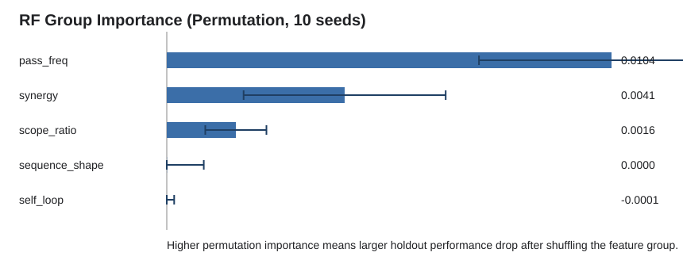

# RF Interpretability Paper Materials

- Batch manifest: `results/manifests/20260505_021422_538199_feature_lite_multiseed_rf_explain_formal_10seeds_20260505_021421.json`
- Successful seeds: `10`
- Objective: `instrcount`, baseline: `oz`, feature mode: `lite`, loop policy: `wrap`
- Positive counterfactual delta means the mutation worsens the objective.

## Model Quality

| Split | RMSE | MAE | R2 | Pearson |
| --- | ---: | ---: | ---: | ---: |
| train | 0.0438 | 0.0323 | 0.9355 | 0.9757 |
| holdout | 0.1168 | 0.0888 | 0.5411 | 0.7536 |

## Top-10 Feature Importance

| Rank | Feature | Group | Permutation importance mean [95% CI] | MDI mean [95% CI] |
| ---: | --- | --- | ---: | ---: |
| 1 | `pass_freq:module(elim-avail-extern)` | pass_freq | 0.004727 [0.002325, 0.007128] | 0.144142 [0.073738, 0.214547] |
| 2 | `pass_freq:module(scc-oz-module-inliner)` | pass_freq | 0.004437 [0.001284, 0.007589] | 0.125483 [0.063442, 0.187524] |
| 3 | `synergy_rate` | synergy | 0.004150 [0.001793, 0.006507] | 0.129006 [0.074898, 0.183114] |
| 4 | `pass_freq:module(globalopt)` | pass_freq | 0.001009 [0.000261, 0.001758] | 0.061674 [0.037659, 0.085690] |
| 5 | `scope_ratio:function` | scope_ratio | 0.000832 [0.000473, 0.001191] | 0.074902 [0.053879, 0.095924] |
| 6 | `scope_ratio:module` | scope_ratio | 0.000732 [0.000247, 0.001218] | 0.073352 [0.054275, 0.092429] |
| 7 | `pass_coverage` | sequence_shape | 0.000368 [-0.000122, 0.000858] | 0.040571 [0.021730, 0.059413] |
| 8 | `pass_freq:function(mem2reg)` | pass_freq | 0.000362 [0.000048, 0.000675] | 0.022034 [0.011987, 0.032081] |
| 9 | `pass_freq:function(gvn-sink)` | pass_freq | 0.000093 [-0.000085, 0.000272] | 0.013766 [0.001309, 0.026222] |
| 10 | `pass_freq:function(reassociate)` | pass_freq | 0.000067 [-0.000047, 0.000181] | 0.007007 [0.000801, 0.013214] |

## Group Importance

| Rank | Group | Permutation sum mean [95% CI] | MDI sum mean [95% CI] |
| ---: | --- | ---: | ---: |
| 1 | `pass_freq` | 0.010377 [0.007284, 0.013469] | 0.475264 [0.413559, 0.536970] |
| 2 | `synergy` | 0.004150 [0.001793, 0.006507] | 0.129006 [0.074898, 0.183114] |
| 3 | `scope_ratio` | 0.001612 [0.000898, 0.002325] | 0.182023 [0.154641, 0.209405] |
| 4 | `sequence_shape` | 0.000004 [-0.000855, 0.000863] | 0.174939 [0.140894, 0.208984] |
| 5 | `self_loop` | -0.000145 [-0.000463, 0.000172] | 0.038767 [0.026526, 0.051008] |

## Counterfactual Validation

| Pass | Mutation | Seeds | Delta objective mean [95% CI] | Delta mean norm | Delta worsen rate |
| --- | --- | ---: | ---: | ---: | ---: |
| `module(scc-oz-module-inliner)` | `delete_all` | 6 | 0.7272 [0.5441, 0.9103] | 0.6150 | 0.7483 |
| `module(scc-oz-module-inliner)` | `delete_first` | 10 | 0.2954 [0.0184, 0.5724] | 0.2546 | 0.2720 |
| `module(elim-avail-extern)` | `delete_first` | 10 | 0.2672 [0.2358, 0.2985] | 0.2217 | 0.3030 |
| `module(globalopt)` | `delete_all` | 1 | 0.1469 [0.1469, 0.1469] | 0.1184 | 0.1900 |
| `module(globalopt)` | `delete_first` | 7 | 0.1390 [0.0823, 0.1957] | 0.1111 | 0.1857 |
| `module(attributor)` | `delete_all` | 1 | 0.1163 [0.1163, 0.1163] | 0.1148 | 0.0100 |
| `module(iroutliner)` | `delete_all` | 1 | 0.0931 [0.0931, 0.0931] | 0.0946 | -0.0100 |
| `module(iroutliner)` | `delete_first` | 1 | 0.0384 [0.0384, 0.0384] | 0.0399 | -0.0100 |
| `module(attributor)` | `delete_first` | 1 | 0.0275 [0.0275, 0.0275] | 0.0275 | 0.0000 |
| `function(gvn-hoist)` | `delete_all` | 1 | 0.0172 [0.0172, 0.0172] | 0.0172 | 0.0000 |
| `function(mem2reg)` | `delete_first` | 1 | 0.0118 [0.0118, 0.0118] | 0.0118 | 0.0000 |
| `function(reassociate)` | `append_once` | 3 | 0.0048 [-0.0016, 0.0113] | 0.0008 | 0.0267 |

## Paper-Ready Conclusion

Across ten random seeds, permutation importance identifies pass-frequency features as the dominant explanatory signal, followed by the synergy-rate feature derived from the pass interaction graph and by pass scope composition. The strongest pass-level signals are `module(elim-avail-extern)`, `module(scc-oz-module-inliner)`, and `module(globalopt)`. Counterfactual LLVM evaluation supports this interpretation: deleting `module(elim-avail-extern)` consistently worsens the validation objective, while deleting all occurrences of `module(scc-oz-module-inliner)` causes the largest degradation among tested mutations. In contrast, self-loop features do not show stable held-out permutation importance, so they should be discussed as a limitation or exploratory signal rather than a main claim.
